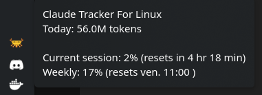
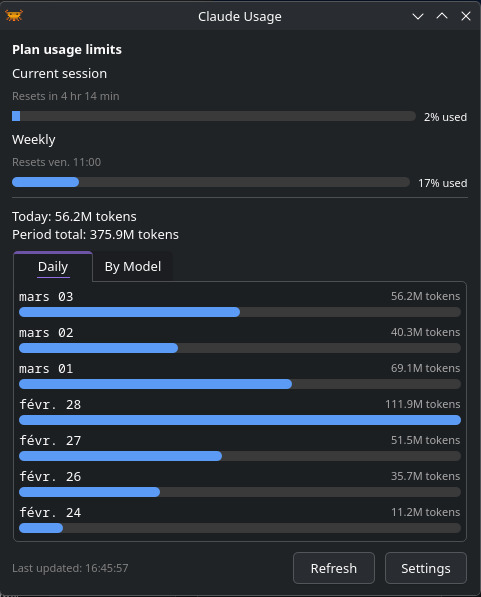

  

<h1 align="center">CTFL — Claude Tracker For Linux</h1>

  A lightweight system tray app to monitor your <a href="https://claude.ai">Claude</a> token usage and rate limits at a glance.

  
  
  
  
  

  <a href="https://ctfl.md-labs.dev">Documentation</a> · <a href="https://github.com/mordup/ctfl/releases/latest">Download</a>

  

  
  &nbsp;
  

## Features

- **Token usage tracking** — daily, per-model, and per-project breakdowns as bar charts
- **Rate limits** — live session and weekly utilization with reset countdowns
- **Desktop alerts** — notifications when usage gets high
- **Multiple data sources** — local Claude Code logs, Anthropic Admin API, or both
- **Built-in updater** — auto-updates for pip and AppImage installs

## Quick start

Download a package from the [Releases](https://github.com/mordup/ctfl/releases/latest) page, or see the [installation guide](https://ctfl.md-labs.dev/installation/) for all options.

## Contributing

Found a bug or have an idea? [Open an issue](https://github.com/mordup/ctfl/issues).

## License

[MIT](LICENSE)
