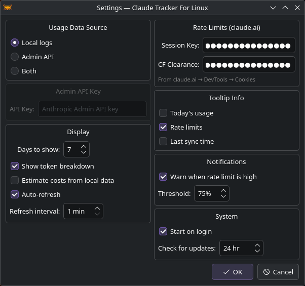

<p align="center">
  
</p>

<h1 align="center">CTFL — Claude Tracker For Linux</h1>

<p align="center">
  A lightweight system tray app to monitor your <a href="https://claude.ai">Claude</a> token usage and rate limits at a glance.
</p>

<p align="center">
  
</p>

## Features

### Usage Monitoring
- **Daily, per-model, and per-project** token breakdowns displayed as bar charts
- **Cost tracking** — daily and total costs alongside token counts (Admin API)
- **Multiple data sources** — local Claude Code logs, Anthropic Admin API, or both

### Rate Limits
- **Live utilization** — session and weekly usage with reset countdowns
- **Desktop alerts** — notifications when usage nears the limit

### System Integration
- **System tray** with a configurable tooltip (today's tokens, limits, sync time)
- **Auto-refresh** and **autostart** on login
- **Built-in updater** — checks for new releases and can auto-update (pip / AppImage)

<p align="center">
  
  &nbsp;
  
</p>

<p align="center">
  
</p>

## Installation

Pre-built packages are available on the [Releases](https://github.com/mordup/ctfl/releases) page.

### AppImage (any distro)

Download `CTFL-x86_64.AppImage`, make it executable, and run:

```bash
chmod +x CTFL-x86_64.AppImage
./CTFL-x86_64.AppImage
```

### Arch Linux

Download the `.pkg.tar.zst` from the [Releases](https://github.com/mordup/ctfl/releases) page and install:

```bash
sudo pacman -U ctfl-*-any.pkg.tar.zst
```

Or build from source:

```bash
git clone https://github.com/mordup/ctfl.git
cd ctfl
makepkg -si
```

### Debian / Ubuntu

```bash
sudo dpkg -i ctfl_*_amd64.deb
```

### Fedora / RPM

```bash
sudo rpm -i ctfl-*.x86_64.rpm
```

## Usage

Launch from your application menu or run:

```bash
ctfl
```

- **Left-click** the tray icon to toggle the usage popup
- **Right-click** for the context menu (refresh, settings, quit)
- **Hover** over the icon to see a quick summary in the tooltip

### Data sources

| Source | Description |
|---|---|
| **Local logs** | Reads Claude Code conversation files from `~/.claude/projects/` — no API key needed |
| **Admin API** | Fetches organization-level usage from the Anthropic Admin API — requires an admin API key |
| **Both** | Merges data from both sources |

Configure the data source and API key in **Settings**.

<p align="center">
  
</p>

## Updating

CTFL can check for new releases automatically (configurable in **Settings → Check for updates**).

| Install method | Update behavior |
|---|---|
| **pip** | Auto-updates in place and restarts |
| **AppImage** | Auto-updates in place and restarts |
| **System package** (deb/rpm/pacman) | Opens the release page to download the new package |

You can also check manually from the tray menu via **Check for Updates**.

## Compatibility

Works on any Linux desktop environment with system tray support:

| Desktop | Status |
|---|---|
| KDE Plasma | Works out of the box |
| XFCE | Works out of the box |
| Cinnamon | Works out of the box |
| MATE | Works out of the box |
| LXQt | Works out of the box |
| GNOME | Requires the [AppIndicator](https://extensions.gnome.org/extension/615/appindicator-support/) extension |
| Sway / i3 / Hyprland | Works with a bar that has tray support (waybar, polybar, etc.) |

## Dependencies

- Python >= 3.11
- PyQt6
- keyring (for secure API key storage)

## About

This application was fully generated by AI ([Claude](https://claude.ai)) using [Claude Code](https://claude.ai/claude-code).

## License

[MIT](LICENSE) — do whatever you want with it.
